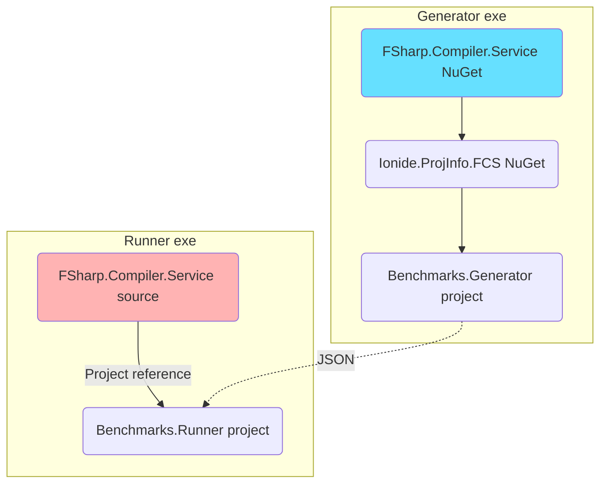
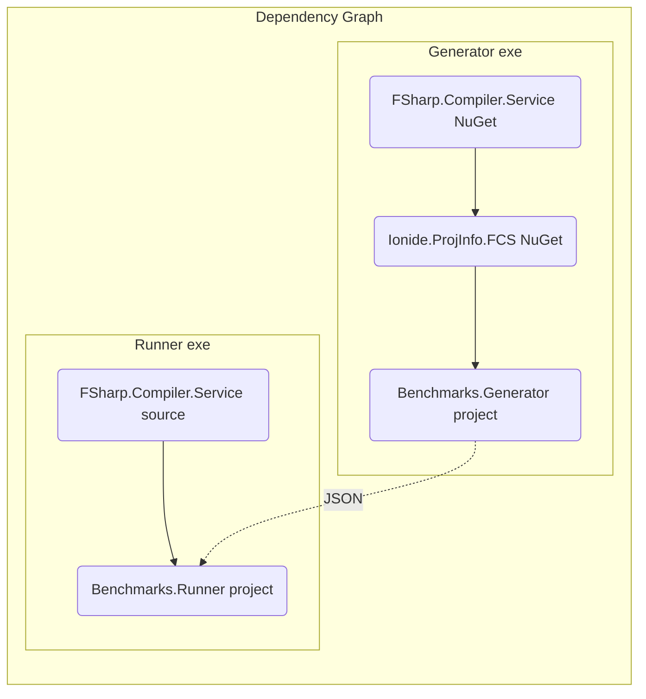

# Benchmarks.Generator

## What is it
A command-line app for generating and running benchmarks of FCS using high-level analysis definitions

## How it works
### Dependency graph

### Process steps graph

## How to use it
### Run `Benchmark.Generator` to generate and run the benchmark
```bash
dotnet run Benchmark.Generator - 
```

## Benchmark description format
The benchmark description is a high-level definition of code analysis that we want to benchmark. It consists of two parts:
- a codebase to be analysed
- specific analysis actions (eg. analyse file `A.fs` in project `B`)

[inputs/](inputs/) directory contains existing samples.

Let's look at [inputs/fantomas.json](inputs/fantomas.json):
```json5
// Checkout a revision of Fantomas codebase and perform a single analysis action on the top-level file
{
  // Repository to checkout as input for code analysis benchmarking
  "Repo": {
    // Short name used for determining local checkout directory
    "Name": "fantomas",
    // Full URL to a publicy-available Git repository
    "GitUrl": "https://github.com/fsprojects/fantomas",
    // Revision to use for 'git checkout' - using a commit hash rather than a branch/tag name guarantees reproducability
    "Revision" : "0fe6785076e045f28e4c88e6a57dd09b649ce671"
  },
  // Solution to open relative to the repo's root - all projects in the solution will be available in action definitions below
  "SlnRelative": "fantomas.sln",
  // A sequence of actions to be performed by FCS on the above codebase
  "CheckActions": [
    // Analyse DaemonTests.fs in the project named Fantomas.Tests
    {
      "FileName": "Integration/DaemonTests.fs",
      // This is a project name only - not project file's path (we currently assume names are unique)
      "ProjectName": "Fantomas.Tests"
    }
  ]
}
```
#### Local codebase
For local testing only a local codebase can be used instead of a publicly available GitHub repo.

Since the specification provides no guarantees about the local codebase's contents, this mode should not be used for comparing results between machines/users (even if the same code is available locally on multiple machines).

See an example from [inputs/local_example.json](inputs/local_example.json): 
```json5
{
  // Path to the locally available codebase
  "LocalCodeRoot": "Path/To/Local/Code/Root",
  // The rest of the options are the same
  "SlnRelative": "solution.sln",
  "CheckActions": [
    {
      "FileName": "library.fs",
      "ProjectName": "root"
    }
  ]
}
```


[link](#process-steps-graph)

